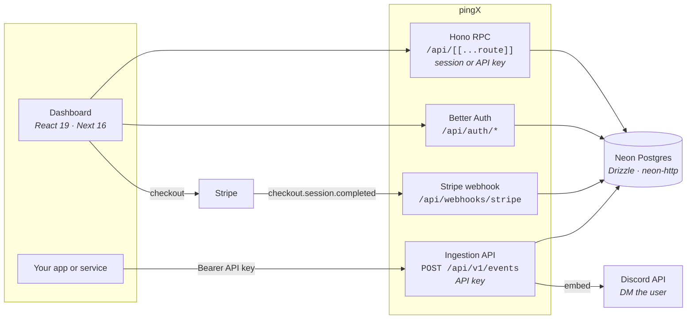

# pingX

[](https://github.com/itsnyein/pingX/actions/workflows/ci.yml)

Next.js 16 App Router SaaS that turns API calls into Discord notifications.
Better Auth for auth, Hono for the API layer, Drizzle ORM on Neon Postgres,
Stripe for billing.

## Getting started

```bash
npm install
cp .env.example .env
# fill in .env, then create the schema:
npm run db:migrate
npm run dev
```

Open [http://localhost:3000](http://localhost:3000).

`STRIPE_SECRET_KEY` must be set for `npm run build` as well as for `npm run dev`
- the Stripe client is constructed at module scope and throws on an empty key.
A dummy `sk_test_placeholder` is enough if you are not touching billing.

### Database driver

`DATABASE_URL` must point at a **Neon** database. `src/db/index.ts` uses
Drizzle's `neon-http` driver, which speaks Neon's SQL-over-HTTP protocol rather
than the Postgres wire protocol - a plain local Postgres will not connect
without a proxy in front of it. A Neon branch is the path of least resistance
for throwaway data.

### Demo data

```bash
npm run db:seed
```

Creates a demo account, three categories and ~50 events spread over 60 days with
mixed delivery statuses, then prints the credentials and API key. Idempotent,
and it refuses to run when `NODE_ENV=production`.

### Discord delivery

Discord will not let a bot DM an arbitrary user, so end-to-end delivery needs
three things: a bot token from the
[Developer Portal](https://discord.com/developers/applications)
(`DISCORD_BOT_TOKEN`); the bot invited to a server you are also in, since a bot
can only DM users it shares a server with; and direct messages from server
members enabled in that server's privacy settings. Your own Discord user ID goes
in `/dashboard/account-settings`.

For billing work, `npm run stripe:listen` tunnels webhooks to localhost and
prints the `whsec_…` value for `STRIPE_WEBHOOK_SECRET`.

## Auth

Better Auth, with email/password plus Google and GitHub OAuth.

```
src/lib/auth.ts          server instance and config
src/lib/auth-client.ts   browser client (authClient.useSession, signIn, signOut)
src/lib/session.ts       server helpers: getSession, getCurrentUser, requireUser
src/app/api/auth/[...all]/route.ts   mounts the Better Auth handler
src/proxy.ts             cheap cookie gate on /dashboard
src/components/auth/     sign-in and sign-up UI
```

Set `BETTER_AUTH_SECRET` and `BETTER_AUTH_URL`. OAuth sign-in fails at runtime
until the Google and GitHub client IDs and secrets are set; register the
callback URL `<BETTER_AUTH_URL>/api/auth/callback/<provider>` with each.

### One user table

pingX's application columns (`plan`, `apiKey`, `discordId`) live
on Better Auth's `user` table rather than in a separate table. That means a
session read already carries them and no join or second query is needed:

```ts
const user = await requireUser()
user.plan     // "FREE" | "PRO"
user.apiKey
```

**These columns are declared in two places** - as Drizzle columns in
`src/db/schema/users.ts`, and as `user.additionalFields` in `src/lib/auth.ts`.
Adding one without the other means the column exists but the auth layer cannot
read or write it. They are marked `input: false`, so a client cannot set its own
plan or quota at signup.

Route protection is layered: `src/proxy.ts` only checks that a session cookie is
present, which is cheap enough to run on every navigation, and each page does
the authoritative `getSession` check before rendering. Do not treat the proxy as
the security boundary.

## Database

The database is Neon Postgres, accessed through Drizzle ORM using the
`neon-http` driver. That driver is stateless and does not support interactive
transactions, which suits this codebase - it issues none. If a transaction is
ever needed, switch `src/db/index.ts` to `drizzle-orm/neon-serverless`.

```
src/db/index.ts        client, plus a re-export of the schema
src/db/schema/         one file per table, plus enums and relations
drizzle.config.ts      drizzle-kit config
drizzle/migrations/    generated migrations
drizzle/manual/        migrations that are applied by hand, never by drizzle-kit
```

Import both the client and the tables from `@/db`:

```ts
import { db, users } from "@/db"
import { eq } from "drizzle-orm"

const [user] = await db.select().from(users).where(eq(users.id, id)).limit(1)
```

### Scripts

| Script | What it does |
| --- | --- |
| `npm run db:generate` | Diff the schema and write a migration to `drizzle/migrations` |
| `npm run db:migrate` | Apply pending migrations |
| `npm run db:push` | Push the schema straight to the database, skipping migration files |
| `npm run db:studio` | Open Drizzle Studio |
| `npm run typecheck` | `tsc --noEmit` |

Review generated SQL before applying it to a database that holds real data.
`db:push` is for scratch databases; it does not ask before dropping things.

### Schema conventions

Better Auth's tables (`user`, `session`, `account`, `verification`) are
lowercase singular, because the adapter addresses them by model name. The
application tables (`EventCategory`, `Event`, `Quota`) keep their original
mixed-case names. Column names are always spelled out explicitly rather than
relying on implicit mapping, so renaming a TypeScript key cannot silently
rename a column.

Worth knowing:

- `updatedAt` columns have no database default - they use `$defaultFn` +
  `$onUpdate` and are managed in the application.
- `Quota.userId` is unique: one quota row per user, incremented across months.
  `year`/`month` record when it was last reset, they are not part of the key.
- Every foreign key to `user` cascades on delete.

See `drizzle/README.md` for details.

## Architecture



The ingestion path is the product: authenticate the key, check the quota, store
the event, deliver it to Discord, then mark it `DELIVERED` or `FAILED`.

## API reference

### `POST /api/v1/events`

Send an event. This is the only public API.

**Authentication** - bearer token, using the key from `/dashboard/api-key`:

```
Authorization: Bearer YOUR_API_KEY
Content-Type: application/json
```

**Body**

| Field | Type | Required | Notes |
| --- | --- | --- | --- |
| `category` | string | yes | Must be an existing category of yours. Letters, digits and hyphens only. |
| `description` | string | no | Shown as the embed description. Defaults to `A new <category> event has occurred`. |
| `data` | object | no | Flat key/value pairs. Values must be string, number or boolean - **nested objects and arrays are rejected**. Each key becomes a field in the Discord embed. |

Unknown top-level fields are rejected - the schema is strict.

```bash
curl -X POST https://ping-x.netlify.app/api/v1/events \
  -H "Authorization: Bearer YOUR_API_KEY" \
  -H "Content-Type: application/json" \
  -d '{
    "category": "sale",
    "description": "New sale came in",
    "data": { "plan": "PRO", "amount": 52.99, "email": "you@example.com" }
  }'
```

**Responses**

| Code | Meaning | Body |
| --- | --- | --- |
| `200` | Stored and delivered | `{ "message": "Event processed successfully", "eventId": "..." }` |
| `400` | Body was not valid JSON | `{ "message": "Invalid request body" }` |
| `401` | Missing, malformed or unknown API key | `{ "message": "Unauthorized" }` / `{ "message": "Invalid API key" }` |
| `403` | No Discord ID saved on the account | `{ "message": "Please enter your discord ID in your account settings" }` |
| `404` | No category of that name | `{ "message": "You dont have a category named \"x\"" }` |
| `422` | Body failed validation, or Discord refused permanently - for example the recipient does not accept DMs | `{ "message": "<reason>" }` |
| `429` | Monthly quota reached | `{ "message": "Monthly quota reached. Please upgrade your plan for more events" }` |
| `502` | Stored, but Discord delivery failed for a reason worth retrying - rate limit, 5xx, network | `{ "message": "Could not deliver the event to Discord...", "eventId": "..." }` |

A `502` or a delivery-related `422` still creates the event - it is stored with
status `FAILED`, the reason is kept on the row, and it is visible on the
category page. A `429` does not create one.

`@discordjs/rest` already retries 5xx and network failures in process and waits
out rate limits, so a `502` means those attempts were exhausted.

**Limits** - `100` events/month and `3` categories on Free; `1,000` and `10` on
Pro. Defined in `src/config.ts`.

## Screenshots

<!-- TODO: add screenshots.
     Suggested set, 1280px wide, light and dark:
       docs/screenshots/dashboard.png       - Account home with categories
       docs/screenshots/category.png        - Event table with status badges
       docs/screenshots/billing.png         - Plan strip and usage meters
       docs/screenshots/discord.png         - A delivered embed in Discord -->

_Coming soon._

## Testing

```bash
npm test              # run once
npm run test:watch    # watch mode
npm run test:coverage # v8 coverage
```

Vitest, configured in `vitest.config.mts` with the same `@/` alias as
`tsconfig.json`. `tests/unit/` is pure - no database, no network - so it runs in
CI without secrets. `tests/integration/` exercises quota rollover against a real
database and skips itself unless `TEST_DATABASE_URL` is set; point it at a
throwaway Neon branch, never at data you care about.

CI (`.github/workflows/ci.yml`) runs typecheck → lint → test → build on Node 20
and 22 for every pull request and every push to `main`.

## Known limitations

Deliberately scoped out rather than overlooked:

- API keys cannot be rotated from the app, and they authorise account
  operations rather than event ingestion alone.
- There is no rate limiting on the ingestion endpoint.
- Delivery is fire-and-forget: a failed Discord send is recorded as `FAILED` and
  never retried.
- `neon-http` issues one statement per round trip and cannot open a transaction,
  so multi-step writes are not atomic. Quota accounting works around this with a
  single upsert rather than a read-then-write.

## Learn more

- [Next.js documentation](https://nextjs.org/docs)
- [Drizzle ORM documentation](https://orm.drizzle.team)
